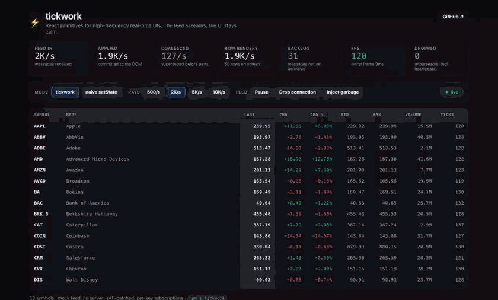
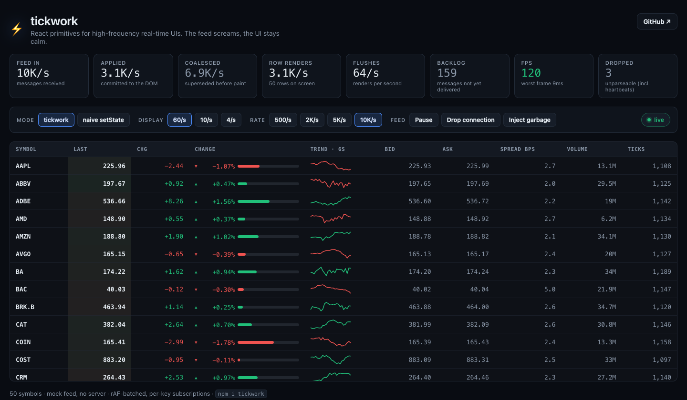
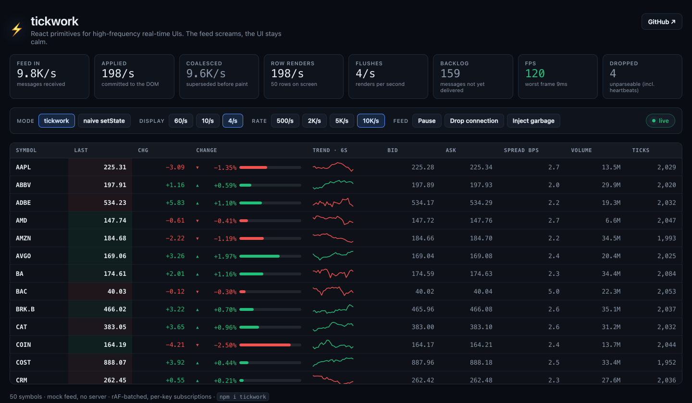
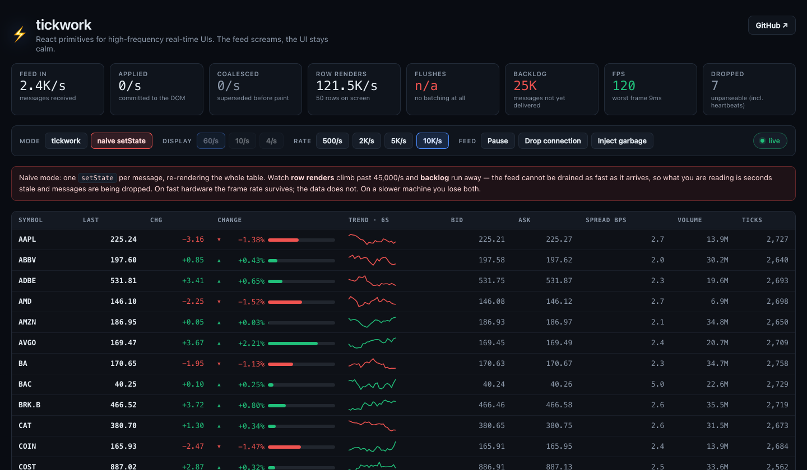
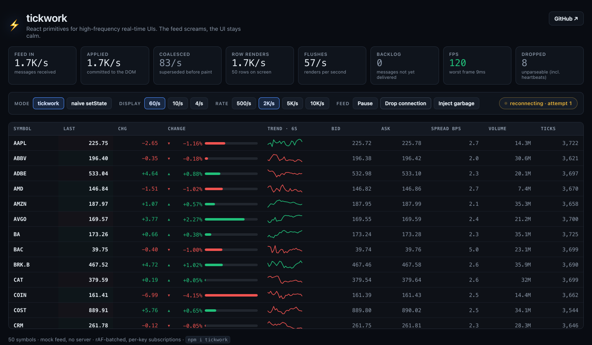

<div align="center">

# ⚡ tickwork

**React primitives for high-frequency real-time UIs.**
Your feed pushes thousands of updates a second. Your UI renders once a frame, and only the rows that changed.

[](https://github.com/anbochkarev1991/tickwork/actions/workflows/ci.yml)
[](#testing)
[](#bundle-size)
[](https://github.com/anbochkarev1991/tickwork/blob/main/packages/tickwork/package.json)
[](https://github.com/anbochkarev1991/tickwork/blob/main/tsconfig.base.json)
[](LICENSE)



*50 symbols · up to 10,000 messages/sec. The **Display** control sets the render rate independently of the data rate; the **Mode** toggle switches the same feed to a naive `setState` per message.*

**[Live demo](https://anbochkarev1991.github.io/tickwork/)** · **[Why](#the-problem)** · **[Quick start](#quick-start)** · **[How it works](#how-it-works)** · **[API](#api)**

</div>

---

## The problem

A naive real-time table calls `setState` for every message:

```tsx
// ❌ One render per message. 2,000 messages/sec = 2,000 renders/sec of every row.
const [rows, setRows] = useState<Record<string, Tick>>({});

useEffect(() => {
  const socket = new WebSocket(url);
  socket.onmessage = (event) => {
    const tick = JSON.parse(event.data);
    setRows((previous) => ({ ...previous, [tick.symbol]: tick }));
  };
  return () => socket.close();
}, [url]);
```

Two things go wrong, and neither is React's fault:

1. **The render rate is bound to the data rate.** A screen refreshes 60–120 times a second. A feed does not care. Every update between two paints is work you did for a frame nobody saw.
2. **One row's update re-renders all of them.** The state lives in a parent, so a tick for `AAPL` re-renders 50 rows.

`tickwork` breaks that coupling:

```tsx
// ✅ Ingest is a Map.set. Rendering happens once per frame, per changed row.
const store = useMemo(() => createRealtimeStore<Tick>({ getKey: (t) => t.symbol }), []);

useWebSocketFeed({ url, parse: createJsonParser(isTick), onItem: store.ingest });
```

### Measured

Same mock feed, same 50-row table, same machine — the demo in this repo, toggled between modes:

| At 10,000 messages/sec across 50 symbols | naive `setState` | `tickwork` @ 60/s | `tickwork` @ 4/s |
| --- | --- | --- | --- |
| Messages actually ingested | **2,400/sec** — the feed backs up | **10,000/sec** | **9,900/sec** |
| Row renders | **121,500/sec** | **3,100/sec** | **200/sec** |
| Updates coalesced away | 0 | 6,900/sec | 9,600/sec |
| Flushes (renders) per second | one per message | 64 | 4 |
| Undelivered backlog after 5s | **25,000 messages** (capped; still growing) | 159 | **0** |
| Frame rate | 120 fps | 120 fps | 120 fps |

The right-hand column is the interesting one. Same feed, same data, **600× less rendering work than the naive version** — and it is the only one of the three a human can actually read.

<table>
<tr>
<td width="33%"><br><em><code>tickwork</code> @ 60/s — 10K/s in, 3.1K row renders, no backlog.</em></td>
<td width="33%"><br><em><code>tickwork</code> @ 4/s — same feed, 200 row renders, and readable.</em></td>
<td width="33%"><br><em>Naive — 121.5K row renders, 25K messages behind.</em></td>
</tr>
</table>

**Read that table honestly.** On a fast machine the naive version does *not* drop frames — it saturates the main thread and falls behind instead. It burns hundreds of times the rendering work to display data that is *seconds stale*, and drops messages it never manages to deliver. That is the real failure mode of a busy dashboard, and it is worse than jank because it is invisible: the UI looks fine while the numbers are wrong. On slower hardware, or with heavier rows, the same saturation becomes visible jank as well.

<sub>Measured in headless Chromium (Playwright) on an Apple-silicon Mac, production build, `PerformanceObserver` long-task probe, averaged over 5s windows. Reproduce it: `npm run demo` and click the toggles.</sub>

---

## Install

```sh
npm install tickwork
```

React 18 or 19 as a peer dependency. No other runtime dependencies. ESM + CJS + types.

> **Not published to npm yet.** Until it is: `npm install github:anbochkarev1991/tickwork`, or clone and `npm run build`.

## Quick start

```tsx
import { useMemo } from 'react';
import {
  createRealtimeStore,
  createJsonParser,
  useWebSocketFeed,
  useRealtimeKeys,
  useRealtimeValue,
  LiveTable,
  type LiveTableColumn,
} from 'tickwork';

interface Tick {
  symbol: string;
  price: number;
  changePct: number;
}

const isTick = (value: unknown): value is Tick =>
  typeof value === 'object' &&
  value !== null &&
  typeof (value as Tick).symbol === 'string' &&
  typeof (value as Tick).price === 'number';

// Module scope: a stable `columns` reference keeps rows memoized.
const columns: LiveTableColumn<Tick>[] = [
  { id: 'symbol', header: 'Symbol', cell: (t) => t.symbol },
  {
    id: 'price',
    header: 'Last',
    align: 'right',
    cell: (t) => t.price.toFixed(2),
    flash: (t) => t.price, // green on a rise, red on a fall
  },
  { id: 'changePct', header: 'Chg %', align: 'right', cell: (t) => `${t.changePct.toFixed(2)}%` },
];

export function Tape() {
  const store = useMemo(() => createRealtimeStore<Tick>({ getKey: (tick) => tick.symbol }), []);

  const feed = useWebSocketFeed<Tick>({
    url: 'wss://example.com/ticks',
    parse: createJsonParser(isTick),
    onItem: store.ingest,
    heartbeat: { timeoutMs: 10_000, intervalMs: 5_000 },
    onReconnect: async () => {
      // A coalescing store holds only the latest value per key, so after a gap
      // you want a fresh snapshot rather than a replay.
      const snapshot = await fetch('/api/snapshot').then((r) => r.json());
      store.ingestMany(snapshot);
    },
  });

  return (
    <>
      <span>{feed.status}</span>
      <LiveTable store={store} columns={columns} />
    </>
  );
}
```

Don't want the table? The store and hooks are headless — build your own row:

```tsx
function Row({ store, symbol }: { store: RealtimeStore<Tick>; symbol: string }) {
  const tick = useRealtimeValue(store, symbol); // subscribes to this key only
  return <li>{tick?.price.toFixed(2)}</li>;
}

function Tape({ store }: { store: RealtimeStore<Tick> }) {
  const symbols = useRealtimeKeys(store); // re-renders only when rows appear/disappear
  return (
    <ul>
      {symbols.map((symbol) => (
        <Row key={symbol} store={store} symbol={symbol} />
      ))}
    </ul>
  );
}
```

---

## How it works

Four ideas, each doing one job.

### 1. Throttle — flush on `requestAnimationFrame`

`ingest` never renders. It writes to a pending `Map` and asks the scheduler for a flush. The default scheduler is one `requestAnimationFrame`, which buys two properties for free:

- **Paint alignment.** State commits right before the browser paints, so React never renders a frame that will not be shown.
- **Background tabs cost nothing.** Browsers stop serving rAF in hidden tabs, so rendering stops completely while updates keep coalescing in memory. One flush catches up when the tab is visible again.

Want a different cadence? `scheduler` is injectable, and `store.setScheduler()` swaps it at runtime while data keeps arriving — `createTimeoutScheduler(250)` for a calm 4Hz view, `createManualScheduler()` to drive flushes by hand in tests. See [making fast data readable](#making-fast-data-readable), because this turns out to be a design tool and not just a performance one.

### 2. Coalesce — latest value per key wins

The pending map is keyed by identity, so a second update for `AAPL` overwrites the first. Between two paints, only the newest value for each key survives; the intermediates are dropped on purpose. Nobody can read a price that was on screen for 0.4ms.

This is what makes the store safe under load: **the queue can never grow past the number of distinct keys**, no matter how hard the feed pushes. 10,000 messages across 50 symbols is at most 50 pending entries. Backpressure is structural, not a policy you have to tune.

```
feed:    A₁ A₂ A₃ B₁ A₄ B₂ B₃ … 2,000 messages
         └──────────── one frame ────────────┘
flush:   A₄ B₃                                ← 2 notifications, 2 row renders
```

At 2,000 msg/sec across 50 symbols, coalescing rarely fires (each symbol gets ~0.3 updates per frame) and the win is pure batching. At 10,000 msg/sec it does most of the work — 6,800 updates/sec superseded before they ever reach the DOM.

### 3. Subscribe — per key, not per store

Each row subscribes to its own key through `useSyncExternalStore`. A flush notifies only the keys that actually changed, so a tick for `AAPL` wakes exactly one component. The key *list* is a separate subscription that fires only when a row is added or removed.

Two details make this correct rather than merely fast:

- **`getSnapshot` returns stable references.** `useSyncExternalStore` calls it on every render and will loop forever if it gets a fresh array each time. The key array is cached and only rebuilt when the key set changes — so a value-only update returns the *identical* array reference.
- **Rows must be memoized.** Fine-grained subscriptions stop a value change from touching the parent, but when the parent *does* re-render (a row appeared), React re-renders every child unless it is wrapped in `memo`. `LiveTableRow` is. If you write your own rows, wrap them — [there is a test that fails if you don't](packages/tickwork/src/__tests__/hooks.test.tsx).

### 4. Reconnect — backoff, heartbeat, resync

`useWebSocketFeed` handles the parts that are boring right up until production:

- **Exponential backoff**, capped: `1s → 2s → 4s → 8s → 16s → 30s → 30s…`. The cap matters more than the curve — unbounded doubling means a client that was offline overnight takes hours to notice the network came back. Optional downward `jitter` for when many clients reconnect to the same server at once.
- **Heartbeat watchdog.** A TCP connection can stay "open" forever after the network has quietly gone away. If no message arrives within `timeoutMs`, the socket is treated as dead and torn down *without* waiting for a `close` event that may never come.
- **`onReconnect` for resync.** Coalescing means the store holds the latest value per key, not a log — so after a gap, refetch a snapshot and `ingestMany` it. There is nothing to replay.
- **A parse boundary that holds.** `parse` may throw, return `null`, or return `undefined`; all three mean "drop it". Truncated frames, a proxy's HTML error page, binary payloads, heartbeat echoes — dropped and counted, never rendered, never thrown. Click **Inject garbage** in the demo.
- **No render per message.** The hook re-renders on connection *status* only. Traffic counters live behind `getMetrics()` so reading them is your choice, not a re-render.



---

## Making fast data readable

Keeping up with a fast feed is a means, not an end. Once the render rate is no longer chained to the data rate, the honest question is: **what rate should a human actually look at?**

At 60 flushes a second, a price is not a number, it is a texture. Sampling one cell in the demo 40 times over two seconds, the text changed **39 times out of 40** at frame rate, and **8 times out of 40** at four flushes a second. The second one you can read. The first one you can only watch.

So the same control that makes tickwork fast also makes it legible:

```ts
// The feed keeps arriving at 10,000/sec. Only the rendering slows down.
store.setScheduler(calm ? createTimeoutScheduler(250) : rafScheduler);
```

Nothing is lost by doing this. The store still ingests every message and still coalesces to the newest value per key — you simply stop painting values no one had time to read. At 10,000/sec that is 9,600 updates a second superseded before paint, 200 row renders instead of 3,100, and a table you can look at.

Frequency is only half of it, though. Real trading screens have never relied on digits alone, and the reasons are worth copying:

| Technique | Why it works |
| --- | --- |
| **Price ladders / DOM** | Price becomes a fixed axis and the *number stops moving*; position carries the meaning. The standard futures-trading UI. |
| **Sparklines** | Trend at a glance. Traders read the shape continuously and the digits only at the moment of execution. |
| **Magnitude bars** | Length is pre-attentive — comparable across rows without reading anything. |
| **Direction arrows** | Redundant encoding. Colour alone fails for the ~8% of men with red–green colour blindness. |
| **Deliberate display throttling** | Many order-entry screens cap the display at 100–250ms regardless of feed rate, for exactly the reason above. |

The demo implements the middle three in about 120 lines of inline SVG and CSS ([`demo/src/cells.tsx`](demo/src/cells.tsx)) — deliberately in the demo and not in the package, because tickwork is not a charting library and a sparkline does not belong in your bundle. Two details there are worth stealing:

- **The sparkline series is sampled, not per-tick.** A sparkline needs a point every few hundred milliseconds, not two hundred a second. Sampling gives a *stable array reference*, so the sparkline subtree memoizes away ~99% of its renders while the row around it updates 40 times a second. And because a coalescing store holds only the newest value per key, anything historical has to be carried on the value or kept in a side buffer — it cannot be recovered from the store.
- **The magnitude bar uses a fixed scale, not the largest value on screen.** Normalising against visible rows would mean a row had to know its neighbours, which would re-render every row on every tick — precisely what the library exists to prevent. Fine-grained rendering has design consequences, and this is one of them.

`<LiveTable>` also honours `prefers-reduced-motion` by dropping the flash entirely, and the flash duration should always sit well under the flush interval so it reads as a pulse rather than a permanently lit cell.

---

## API

### `createRealtimeStore<T>(options)`

```ts
const store = createRealtimeStore<Tick>({
  getKey: (tick) => tick.symbol,
  merge: (previous, incoming) => ({ ...previous, ...incoming }), // optional: partial updates
  areEqual: (a, b) => a.price === b.price,                        // optional: suppress no-ops
  scheduler: rafScheduler,                                        // optional
  initialItems: seedRows,                                         // optional
});
```

| Option | Type | Default | Notes |
| --- | --- | --- | --- |
| `getKey` | `(item: T) => string` | — | Row identity. Same key = same row, newest wins. |
| `merge` | `(previous: T \| undefined, incoming: T) => T` | replace | For feeds that send deltas. `previous` is the pending value if one is queued, else the committed one. |
| `areEqual` | `(a: T, b: T) => boolean` | `===` | Return `true` to suppress the notification entirely; the old object is kept so React sees no change. |
| `scheduler` | `Scheduler` | `rafScheduler` | Where flushes come from. |
| `initialItems` | `Iterable<T>` | — | Committed immediately, no notifications. |

| Member | Description |
| --- | --- |
| `ingest(item)` | Queue one item. A `Map.set` plus at most one rAF request. |
| `ingestMany(items)` | Queue a batch with a single scheduling call. |
| `getSnapshot(key)` | Committed value or `undefined`. Reference-stable between flushes. |
| `subscribe(key, listener)` | Subscribe to one key. Returns an unsubscribe function. |
| `getKeys()` | Keys in insertion order. Same array reference until the key *set* changes. |
| `subscribeKeys(listener)` | Subscribe to the key set. Never fires on value changes. |
| `getAll()` | Every committed value, as a fresh array. |
| `remove(key)` / `clear()` | Synchronous, and notify immediately. |
| `flushNow()` | Apply queued updates now instead of waiting for the scheduler. |
| `setScheduler(scheduler)` | Change the flush cadence at runtime. A queued flush is re-armed on the new scheduler, so switching never drops an update. |
| `getMetrics()` | `{ ingested, coalesced, applied, flushes, size, pending }`. |
| `resetMetrics()` | Zero the throughput counters. |
| `dispose()` | Cancel pending work, drop listeners, stop scheduling. |

### `useRealtimeValue(store, key)`

Subscribes to one key. Returns `T | undefined`. This is the hook that makes it fast.

### `useRealtimeKeys(store)`

Subscribes to the key set. Returns `readonly string[]`, reference-stable between key-set changes.

### `useRealtimeMetrics(store, intervalMs = 500)`

Polls `getMetrics()` on an interval. Deliberately not a subscription: at 5,000 updates/sec you want to see the numbers a few times a second, not re-render a stats panel 5,000 times. `intervalMs = 0` reads once.

### `useWebSocketFeed<T>(options)`

| Option | Type | Default | Notes |
| --- | --- | --- | --- |
| `url` | `string \| null \| undefined` | — | `null` keeps the hook idle. Changing it reconnects. |
| `parse` | `(raw: unknown) => T \| T[] \| null \| undefined` | — | The trust boundary. Throw or return nothing to drop. Arrays are treated as batches. |
| `onItem` | `(item: T) => void` | — | Usually `store.ingest`. |
| `onOpen` | `({ attempt, reconnected }) => void` | — | |
| `onReconnect` | `({ attempt }) => void` | — | Fires on re-open after a failure. Resync here. |
| `onClose` / `onError` | `(event) => void` | — | |
| `onParseError` | `(error, raw) => void` | — | Called instead of crashing. |
| `onHeartbeatTimeout` | `() => void` | — | The watchdog fired. |
| `onGiveUp` | `({ attempts }) => void` | — | `maxAttempts` exhausted. |
| `reconnect` | `ReconnectOptions \| false` | enabled | `{ initialDelayMs: 1000, maxDelayMs: 30000, factor: 2, jitter: 0, maxAttempts: ∞ }` |
| `heartbeat` | `HeartbeatOptions \| false` | off | `{ timeoutMs, intervalMs?, message? }` — `timeoutMs` is the watchdog, `intervalMs` sends keepalives. |
| `protocols` | `string \| string[]` | — | |
| `socketFactory` | `(url, protocols?) => WebSocketLike` | `new WebSocket` | For tests, mocks, custom transports. |
| `autoConnect` | `boolean` | `true` | `false` waits for `connect()`. |

Returns `{ status, attempt, send, connect, disconnect, getSocket, getLastMessageAt, getMetrics }`, where `status` is `'connecting' | 'open' | 'reconnecting' | 'closed'` and `getMetrics()` gives `{ received, parsed, dropped, opens, reconnects, errors }`.

### `<LiveTable store columns />`

A small styled table built entirely from the public hooks — the demo-and-screenshots layer, not a data grid. Sorting, filtering, paging and virtualization stay outside: pass the `keys` you want, in the order you want.

| Prop | Type | Default | Notes |
| --- | --- | --- | --- |
| `store` | `RealtimeStore<T>` | — | |
| `columns` | `readonly LiveTableColumn<T>[]` | — | Keep the reference stable; rows are memoized on it. |
| `keys` | `readonly string[]` | store's keys | Your chance to sort or filter. |
| `emptyMessage` | `ReactNode` | `'Waiting for data…'` | |
| `maxHeight` | `number \| string` | — | The wrapper scrolls; headers stick. |
| `rowClassName` | `(item, key) => string \| undefined` | — | |
| `onRowClick` | `(item, key) => void` | — | |
| `flashDurationMs` | `number` | `400` | `0` disables flashing. |
| `injectStyles` | `boolean` | `true` | `false` to bring your own CSS. |
| `caption`, `className`, `style`, `aria-label` | | | |

A column is `{ id, header?, cell, align?, width?, className?, flash? }`. `flash` returns a comparable number; the cell pulses green on a rise and red on a fall by toggling a class on the DOM node directly — no extra state, so no extra renders.

### Also exported

`rafScheduler`, `createTimeoutScheduler(ms)`, `createManualScheduler()`, `createJsonParser(guard?)`, `computeBackoffDelay(attempt, options?)`, `ensureLiveTableStyles()`, `LIVE_TABLE_STYLES`, `useLatestRef(value)`, and every type above.

---

## Testing

119 tests, no flakes, no timing luck: fake timers, a mock `WebSocket`, and a hand-rolled `requestAnimationFrame` mock so every test states exactly how many frames elapsed.

```sh
npm test          # 119 tests
npm run coverage  # thresholds enforced at 90%
```

| File | Statements | Branches |
| --- | --- | --- |
| `store.ts` | 100% | 98.7% |
| `hooks.ts` | 100% | 100% |
| `scheduler.ts` | 100% | 100% |
| `parsers.ts` | 100% | 100% |
| `live-table.tsx` | 100% | 95.9% |
| `use-web-socket-feed.ts` | 96.2% | 90.4% |
| **All** | **98.2%** | **94.8%** |

What the tests actually pin down, beyond the happy paths:

- 10,000 ingests with no flush leave **50 pending entries**, not 10,000 — backpressure, asserted.
- `getKeys()` returns the **identical array reference** across 100 value updates.
- A subscription for `AAPL` does not fire when `MSFT` changes; the key-list subscription does not fire when a value changes.
- The backoff schedule is exactly `1s, 2s, 4s, 8s, 16s, 30s, 30s, 30s` — asserted one millisecond either side of each boundary.
- The heartbeat watchdog resets on every message, and tears down a half-open socket that never sends `close`.
- Unmount closes the socket, detaches every listener, and cancels a pending reconnect timer.
- `<LiveTable>` re-renders **only** the changed row: 5,000 messages across two symbols produce exactly two row renders.
- The feed connects correctly under `StrictMode`'s mount → unmount → mount cycle. *(This one caught a real bug — see below.)*
- `setScheduler` moves a *queued* flush onto the new cadence rather than dropping it, routes later ingests through the new scheduler, treats a repeat call as a no-op, and cannot resurrect a disposed store.
- The same 60 messages produce 6 notifications at frame rate and 1 at a calm cadence, with an identical final value — coalescing, asserted as a readability property rather than just a throughput one.

### The documentation is tested too

Every number on this page — the test count, each row of the coverage table, both
bundle sizes — is re-measured by `npm run docs:check` and compared against the
claim. Overstating coverage fails. Understating the bundle fails. Letting the
two READMEs disagree about the install command, the size or the licence fails.
It runs in CI on every push, which is why the tables here are worth reading.

```sh
npm run docs:check   # 29 claims verified against a fresh measurement
```

## Bundle size

| | min+gzip |
| --- | --- |
| Headless core (store + hooks + feed + parser) | **3.2 kB** |
| Everything, including `<LiveTable>` and its CSS | **4.6 kB** |

`sideEffects: false`, so importing only the store leaves the table out of your bundle.

---

## Built in a day with an AI-driven workflow

This library was specced, built, tested and documented in about a day, working with Claude in tight loops: spec a piece → generate → run it → read the failure → refine. Two habits did most of the work.

**Keep human judgment where it matters.** The API shape, the decision to make coalescing structural rather than configurable, the choice to expose feed metrics through a getter instead of state — those were design calls, made deliberately. Generation is fast at filling in a decision; it is not a substitute for making one.

**Run the thing, don't just test it.** Two of the most valuable findings came from the app, not the suite:

- The first screenshot of the demo showed `closed` and an empty table. `StrictMode`'s mount → unmount → mount cycle ran `destroy()` before the second `connect()`, and `destroy()` set a permanent flag — so **the feed never connected in any development build**. 113 green tests had not noticed, because none of them rendered inside `StrictMode`. There are three that do now, and they fail without the fix.
- The first version of the demo's mock socket emitted each 16ms batch of messages *synchronously*. React's automatic batching collapsed all 32 into a single render, so naive mode sailed along at 120fps and the comparison was quietly rigged in its favour. A real WebSocket delivers each frame in its own task; the mock now does too, which is what turned "the naive version looks fine" into the numbers in the table above.

Both are the same lesson: an AI-assisted build gets you to *plausible* very quickly, and plausible is exactly what you have to go looking for holes in.

---

## Repo layout

```
packages/tickwork/    the library — zero runtime dependencies
demo/                 the Vite demo, mock feed and all
docs/                 screenshots and the GIF
```

```sh
npm install
npm run demo       # the demo at http://localhost:5173
npm test           # tests
npm run ci         # typecheck → lint → coverage → build
```

## Non-goals

Not a charting library. Not a data grid — no built-in sorting, filtering or paging. Does not reimplement virtualization (pair it with `react-window`; rows are already independent). Not a state-management framework and not a design system. It does one thing: decouple the data rate from the render rate.

## License

MIT © Anton Bochkarev
